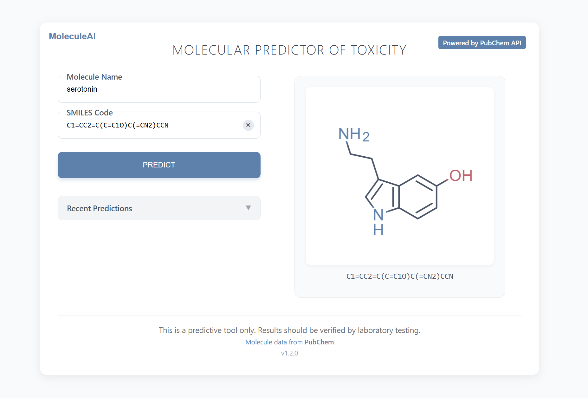

# Молекулярный предиктор токсичности

Фронтенд веб-приложения на React для прогнозирования уровня токсичности молекул с использованием нотации SMILES и интеграцией с базой данных PubChem.



## Возможности

- Поиск молекул напрямую из базы данных PubChem
- Преобразование между названиями молекул и нотацией SMILES
- Интерактивная визуализация молекулярной структуры
- Прогнозирование токсичности со значениями LD50
- Отображение подробных молекулярных свойств (мол. масса, LogP, H-доноры, H-акцепторы)
- История прогнозов для быстрого доступа
- Экспорт результатов в CSV

## Используемые технологии

- React
- SmilesDrawer для визуализации молекул
- PubChem API для получения молекулярных данных

## Начало работы

### Предварительные требования

- Node.js (версия 14.0.0 или выше)
- npm

### Установка

1. Клонируйте репозиторий
```bash
git clone https://github.com/mihailpestrikov/moleculeai
cd moleculeai
```

2. Установите зависимости
```bash
npm install
```

3. Запустите сервер разработки
```bash
npm start
```

4. Откройте браузер и перейдите по адресу `http://localhost:3000`

## Использование

1. **Поиск молекулы**
   - Введите название молекулы в поле поиска (минимум 3 символа)
   - Выберите из появившихся подсказок
   - Альтернативно, введите код SMILES непосредственно в поле ввода SMILES

2. **Визуализация молекулы**
   - Молекулярная структура автоматически отображается после ввода корректного кода SMILES

3. **Получение прогноза токсичности**
   - Нажмите кнопку "PREDICT" для генерации значений токсичности
   - Просмотрите прогноз LD50 и классификацию

4. **Экспорт результатов**
   - Нажмите кнопку "EXPORT" для скачивания результатов в формате CSV

5. **Доступ к истории**
   - Ранее спрогнозированные молекулы хранятся в разделе "Recent Predictions"
   - Нажмите на любую запись для быстрой загрузки этой молекулы

## Структура проекта

```
src/
├── components/
│   └── MoleculePredictor/
│       ├── index.jsx
│       ├── MoleculePredictor.jsx
│       ├── MoleculePredictor.css
│       ├── MoleculeInput/
│       │   ├── MoleculeInput.jsx
│       │   └── MoleculeInput.css
│       ├── MoleculeVisualization/
│       │   ├── MoleculeVisualization.jsx
│       │   └── MoleculeVisualization.css
│       └── PredictionResult/
│           ├── PredictionResult.jsx
│           └── PredictionResult.css
├── services/
│   └── PubChemService.jsx
├── App.jsx
└── main.jsx
```


## Интеграция с API

Этот проект использует API PubChem для получения данных о молекулах. Основные используемые эндпоинты:

- `/rest/autocomplete/compound/{name}/json` - Для поиска по названию молекулы
- `/rest/pug/compound/cid/{cid}/property/{properties}/JSON` - Для получения свойств молекулы
- `/rest/pug/compound/name/{name}/cids/JSON` - Для получения идентификаторов соединений
